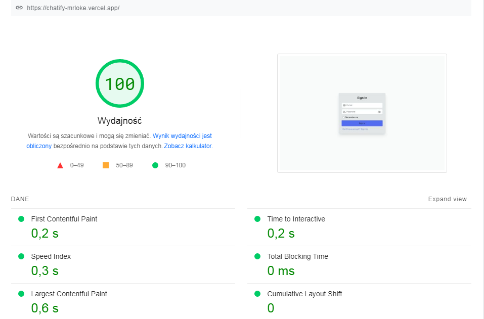

<div style="text-align:center">
  
</div>

## Educational chat communicator project, the whole code is created by me. 🎉

## [LIVE DEMO](https://chatify-mrloke.vercel.app/signin) 🚨

## Credentials 💳

- E-mail: demo@gmail.com
- Password: Demo123

## Features 🚀

- Sign in / Sign up validation
- Create new channels
- Send text messages and attach image
- Toggle light / dark mode
- Search registered users
- Edit user name, email, password, avatar and delete account
- Users status
- Mobile responsive
- PWA support
- SEO support

## Tech stack 🛠️

- React.js
- Next.js
- TypeScript
- Firebase auth
- Firestore database
- Tailwind-css
- React-Hook-Form
- Jest
- React-Testing-Library
- Next-PWA
- Next-SEO

## Performance ⚡



## Installation 📥

```bash
git clone https://github.com/MrLoke/chatify.git

npm install

npm run dev

# for tests: npm run test
```

Fill your .env variables from https://console.firebase.google.com/u/0/

```bash
NEXT_PUBLIC_URL=localhost:3000
NEXT_PUBLIC_FIREBASE_API_KEY=
NEXT_PUBLIC_FIREBASE_AUTH_DOMAIN=
NEXT_PUBLIC_FIREBASE_PROJECT_ID=
NEXT_PUBLIC_FIREBASE_STORAGE_BUCKET=
NEXT_PUBLIC_FIREBASE_MESSAGING_SENDER_ID=
NEXT_PUBLIC_FIREBASE_APP_ID=
```
